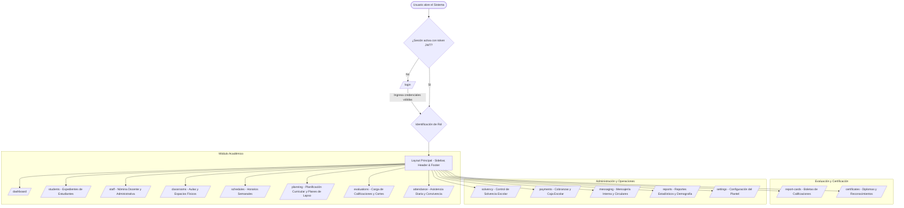
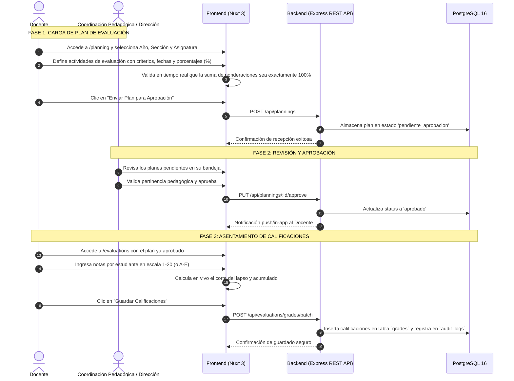
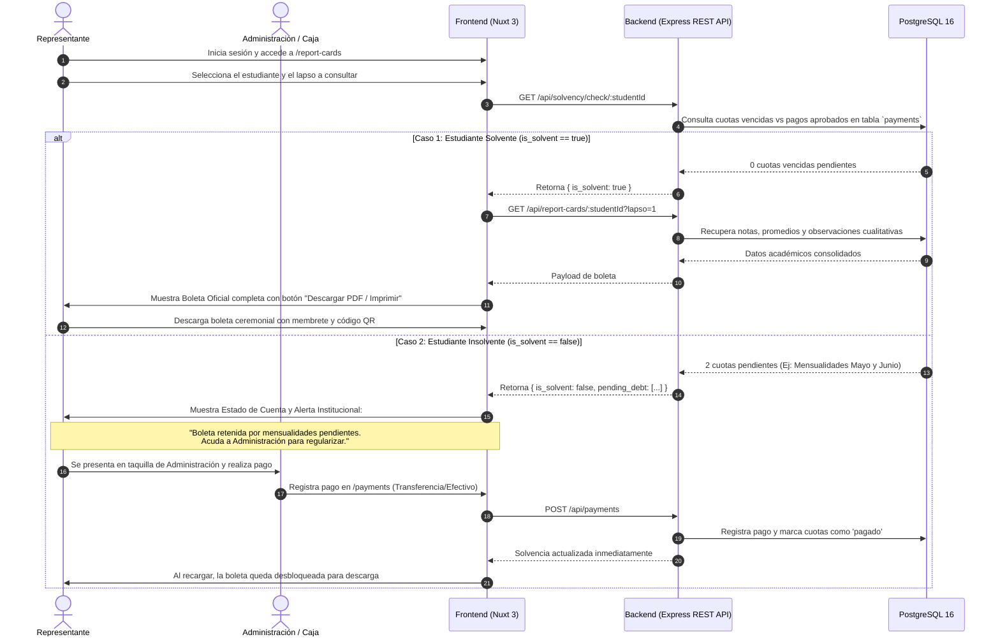
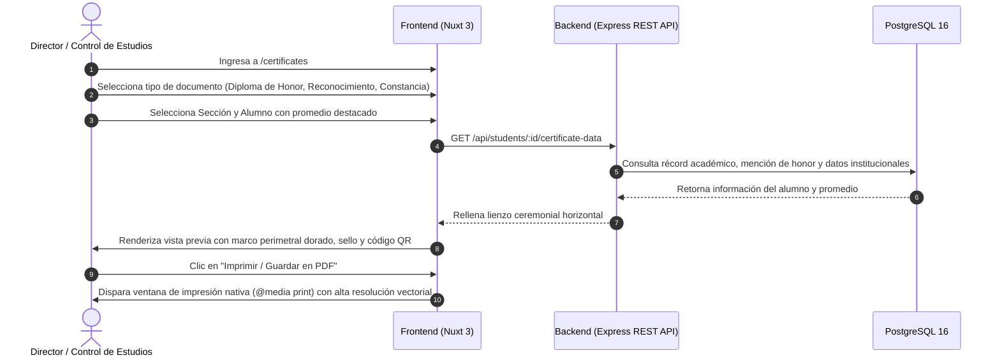

# 4. App Flow & User Navigation
## Sistema de Gestión Escolar Integral — U.E. Santa Luisa v1.0

---

## 1. Mapa de Navegación General del Sistema

---

## 2. Flujo Operativo: Registro y Planificación Curricular del Docente

---

## 3. Flujo Operativo: Emisión de Boletas y Puerta de Solvencia Administrativa

Este flujo resuelve uno de los requerimientos clave de la institución: garantizar el control de la cobranza escolar sin comprometer el registro pedagógico de las notas.

---

## 4. Flujo Operativo: Emisión de Diplomas y Certificados Oficiales

