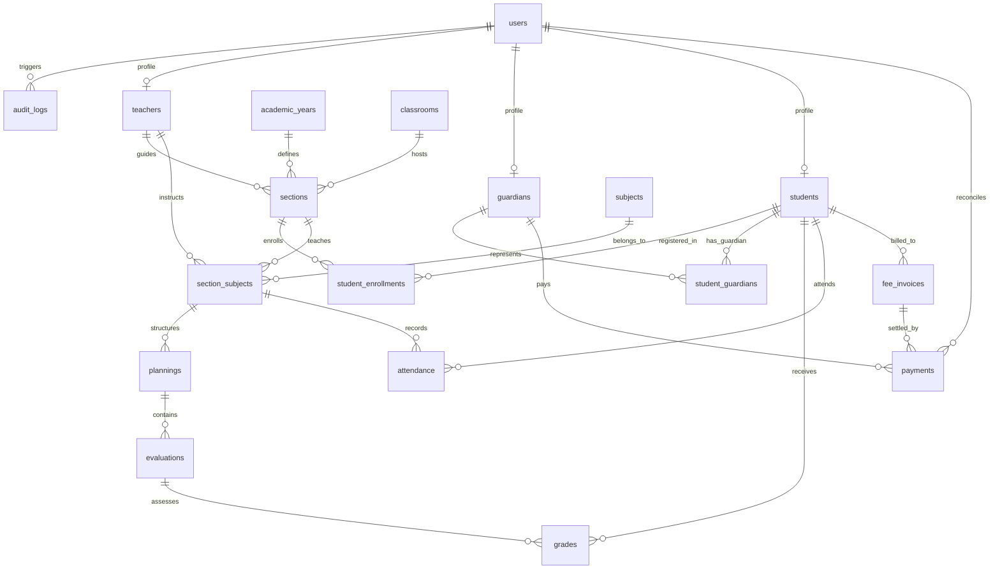

# 5. Backend Schema & Database Architecture
## Sistema de Gestión Escolar Integral — U.E. Santa Luisa v1.0

---

## 1. Diagrama Entidad-Relación (ERD) en PostgreSQL 16

---

## 2. Esquema Relacional de Base de Datos (`school`)

La base de datos reside en un esquema dedicado denominado `school`, implementando claves primarias artificiales con identificadores únicos universales (`UUID v4`) para exposición en endpoints públicos, y claves numéricas `SERIAL` internas para máxima velocidad en índices relacionales.

### A. Módulo de Identidad y Control de Acceso (RBAC)

#### `school.users`
| Columna | Tipo | Restricciones | Descripción |
|---|---|---|---|
| `id` | `SERIAL` | `PRIMARY KEY` | Identificador autoincremental interno. |
| `uuid` | `UUID` | `UNIQUE NOT NULL` | UUID v4 para comunicación con clientes externos. |
| `username` | `VARCHAR(50)` | `UNIQUE NOT NULL` | Cédula o nombre de usuario único. |
| `email` | `VARCHAR(255)` | `UNIQUE NOT NULL` | Correo electrónico del usuario. |
| `password_hash`| `VARCHAR(255)` | `NOT NULL` | Contraseña encriptada con Bcrypt (costo 12). |
| `role` | `VARCHAR(30)` | `NOT NULL` | Rol: `superadmin`, `director`, `control_estudios`, `docente`, `administracion`, `representante`, `estudiante`. |
| `is_active` | `BOOLEAN` | `DEFAULT TRUE` | Estado de la cuenta de usuario. |
| `created_at` | `TIMESTAMPTZ` | `DEFAULT CURRENT_TIMESTAMP` | Fecha de creación del registro. |

#### `school.audit_logs`
| Columna | Tipo | Restricciones | Descripción |
|---|---|---|---|
| `id` | `BIGSERIAL` | `PRIMARY KEY` | Identificador de auditoría inmutable. |
| `user_id` | `INT` | `REFERENCES users(id)` | Usuario que ejecutó la acción. |
| `action` | `VARCHAR(100)` | `NOT NULL` | Acción (`GRADE_UPDATE`, `PLAN_APPROVE`, `PAYMENT_RECONCILE`). |
| `table_name` | `VARCHAR(50)` | `NOT NULL` | Tabla auditada. |
| `record_id` | `INT` | `NOT NULL` | ID del registro afectado. |
| `old_value` | `JSONB` | `NULL` | Estado anterior en formato JSON. |
| `new_value` | `JSONB` | `NULL` | Nuevo estado aplicado en formato JSON. |
| `ip_address` | `INET` | `NULL` | Dirección IP del cliente emisor. |
| `created_at` | `TIMESTAMPTZ` | `DEFAULT CURRENT_TIMESTAMP` | Estampa temporal precisa del evento. |

---

### B. Módulo de Matrícula y Estructura Académica

#### `school.students`
- `id`: Clave primaria autoincremental.
- `uuid`: Identificador universal v4.
- `student_code`: Código único de matrícula del alumno (`SL-2026-XXXX`).
- `id_card`: Cédula de Identidad o Cédula Escolar.
- `first_name`, `last_name`: Nombres y apellidos completos.
- `birth_date`: Fecha de nacimiento.
- `gender`: Género (`M`, `F`).
- `blood_type`: Grupo sanguíneo y factor RH.
- `medical_notes`: Alergias, condiciones médicas o requerimientos dietéticos.
- `status`: Condición del estudiante (`activo`, `retirado`, `egresado`, `suspendido`).

#### `school.classrooms`
- `id`: Clave primaria.
- `room_number`: Código de aula (ej: `A-101`, `LAB-QUI`).
- `name`: Nombre descriptivo (ej: `Aula 1er Año A`, `Laboratorio de Ciencias`).
- `capacity`: Aforo máximo permitido de estudiantes.
- `type`: Tipo de espacio (`aula_regular`, `laboratorio`, `biblioteca`, `auditorio`, `cancha`).
- `floor`: Nivel o piso de ubicación.
- `building`: Bloque o edificio institucional.

#### `school.sections`
- `id`: Clave primaria.
- `academic_year_id`: Período escolar activo (ej: `2025-2026`).
- `level`: Nivel formativo (`inicial`, `primaria`, `media_general`).
- `grade_year`: Año o grado que cursan (ej: `1`, `2`, `3`, `4`, `5`).
- `section_letter`: Letra de sección (`A`, `B`, `C`, `D`).
- `guide_teacher_id`: Docente guía / tutor de aula asignado.
- `classroom_id`: Salón de clases principal asignado.

---

### C. Módulo de Planificación, Evaluación y Calificaciones (MPPE)

#### `school.plannings`
- `id`: Clave primaria.
- `section_subject_id`: Vinculación entre sección, materia y profesor titular.
- `lapso`: Lapso evaluativo (`1`, `2`, `3`).
- `unit_title`: Título de la unidad curricular o tema generador.
- `pedagogical_strategy`: Estrategia didáctica e instrumentos pedagógicos.
- `status`: Estado del plan (`borrador`, `pendiente_aprobacion`, `aprobado`, `rechazado`).
- `approved_by_id`: Directivo o coordinador que aprobó la planificación.

#### `school.evaluations`
- `id`: Clave primaria.
- `planning_id`: Plan de lapso al que pertenece la actividad.
- `title`: Título de la evaluación (ej: `Taller Práctico de Ecuaciones`, `Defensa Oral`).
- `weight_percentage`: Porcentaje de ponderación sobre el 100% del lapso (ej: `20.00%`).
- `instrument`: Instrumento de evaluación (`escala_estimacion`, `rubrica`, `prueba_escrita`).
- `scheduled_date`: Fecha planificada de aplicación.

#### `school.grades`
- `id`: Clave primaria.
- `evaluation_id`: Evaluación a la que corresponde la nota.
- `student_id`: Estudiante calificado.
- `score_vigesimal`: Calificación numérica de 1 a 20 puntos (Media General).
- `score_literal`: Calificación literal de A a E (Inicial y Primaria).
- `qualitative_feedback`: Observaciones cualitativas de logro y refuerzo.
- `graded_by_teacher_id`: Docente que asienta la nota.
- `graded_at`: Fecha y hora de registro.

---

### D. Módulo de Administración, Cobranzas y Solvencias

#### `school.fee_invoices` (Cuotas y Mensualidades)
- `id`: Clave primaria.
- `student_id`: Estudiante asociado a la cuota.
- `concept_name`: Descripción de la cuota (ej: `Mensualidad Mayo 2026`).
- `amount_usd`: Importe estipulado en dólares estadounidenses ($).
- `due_date`: Fecha límite de pago oportuno sin recargo.
- `is_paid`: Booleano de estado de cancelación (`true` / `false`).

#### `school.payments` (Registro de Cobro y Conciliación)
- `id`: Clave primaria.
- `invoice_id`: Factura o cuota cancelada.
- `guardian_id`: Representante que emite el pago.
- `amount_paid_usd`: Monto equivalente pagado en USD.
- `amount_paid_ves`: Monto efectivo pagado en Bolívares soberanos.
- `bcv_exchange_rate`: Tasa oficial del Banco Central de Venezuela al momento de la transacción.
- `payment_method`: Método (`transferencia_bancaria`, `pago_movil`, `efectivo_usd`, `punto_venta`).
- `transaction_reference`: Número de comprobante o referencia bancaria.
- `verified_by_user_id`: Funcionario de Administración que concilia y valida la operación.
- `verified_at`: Fecha de confirmación bancaria.
