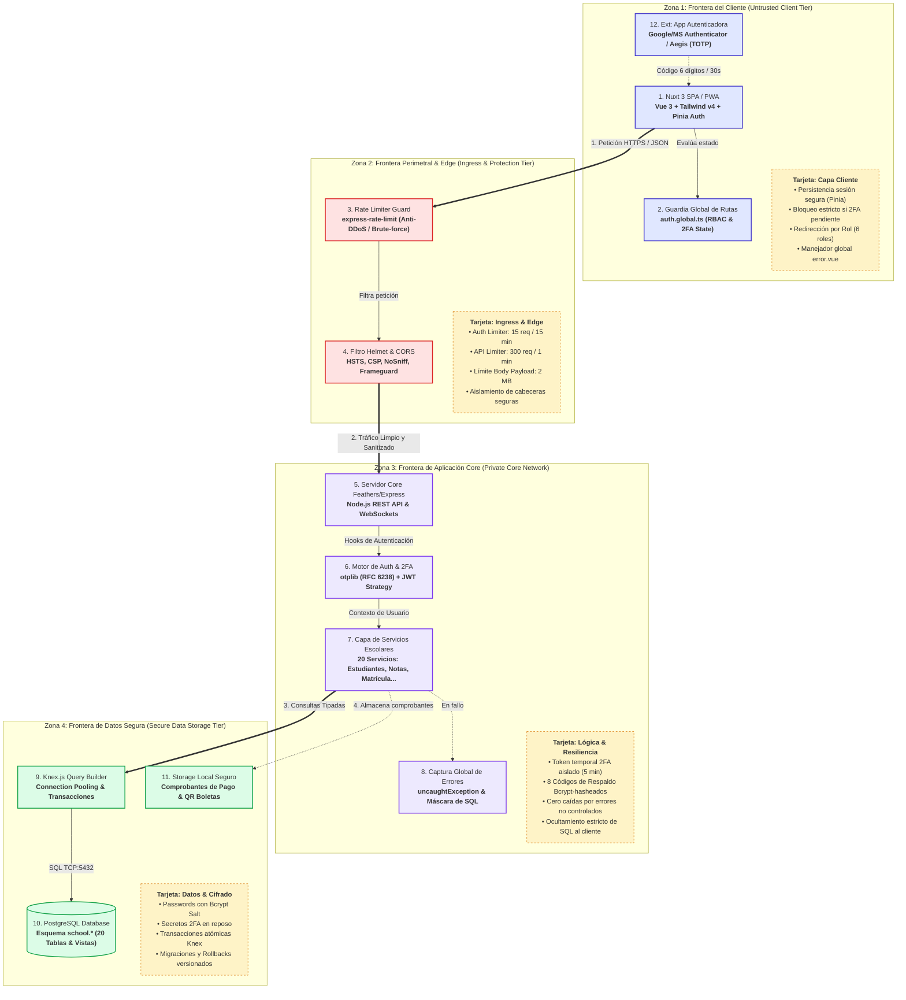

# Arquitectura de Tiempo de Ejecución (Runtime Architecture)
**Sistema de Gestión Escolar EduFlow — U.E Colegio "Santa Luisa"**

Este documento describe la topología y arquitectura de ejecución del sistema EduFlow v2.4.0, cubriendo los 12 componentes principales, las 4 fronteras de confianza (Trust Boundaries), el flujo de ejecución primario (Primary Path) y las políticas de seguridad y resiliencia implementadas.

---

## 1. Dónde y Cómo Ver los Diagramas

Tienes 3 formas inmediatas de ver este diagrama:

1. **En la Aplicación Web Directamente**:
   - Inicia sesión y ve a **Documentación** en la barra superior o en el menú de usuario (`http://localhost:3001/documentation`).
   - Haz clic en la pestaña **"Arquitectura Técnica & Diagramas"**. Allí encontrarás el mapa interactivo de componentes visual, el flujo de ejecución y las tarjetas de soporte.
2. **En este Repositorio**:
   - **Formato Markdown / Mermaid**: Este archivo ([`docs/ARCHITECTURE.md`](file:///home/jav1978/Documents/Desarrollo2026/Aplicaciones/school-management/docs/ARCHITECTURE.md)) renderiza el diagrama en vivo dentro de tu editor (VSCode / Antigravity IDE) o en GitHub.
   - **Lienzo Excalidraw editable**: El archivo nativo está guardado en [`docs/architecture-runtime.excalidraw`](file:///home/jav1978/Documents/Desarrollo2026/Aplicaciones/school-management/docs/architecture-runtime.excalidraw). Puedes abrirlo directamente con la extensión de Excalidraw o importarlo arrastrándolo a [excalidraw.com](https://excalidraw.com).
3. **En el Panel Visual de Antigravity IDE**:
   - El agente generó una vista interactiva de Excalidraw que puedes abrir o inspeccionar desde la interfaz del asistente.

---

## 2. Diagrama de Arquitectura de Tiempo de Ejecución (Mermaid)



---

## 3. Matriz de los 12 Componentes Principales

| # | Componente | Zona de Confianza | Tecnología / Archivo | Responsabilidad Principal |
|---|---|---|---|---|
| **1** | **Nuxt 3 SPA / PWA** | Zona 1 (Cliente) | Vue 3, Tailwind v4, Pinia | Interfaz de usuario reactiva, formularios de gestión escolar, generador de boletas e impresión CSS. |
| **2** | **Guardia Global de Rutas** | Zona 1 (Cliente) | `frontend/middleware/auth.global.ts` | Valida credenciales JWT, aísla al usuario si tiene 2FA pendiente (`/auth/2fa-challenge`) y aplica RBAC (6 roles). |
| **3** | **Rate Limiter Guard** | Zona 2 (Ingress) | `backend/src/middleware/rate-limiter.js` | Defiende la API: limita a 15 intentos/15 min en `/authentication` y 300 req/min en servicios generales. |
| **4** | **Filtro Helmet & CORS** | Zona 2 (Ingress) | `helmet`, `express.json({ limit: '2mb' })` | Inyecta cabeceras de protección (HSTS, CSP, X-Frame-Options) y limita payloads a 2MB. |
| **5** | **Servidor Core Feathers** | Zona 3 (App Core) | `backend/src/app.js`, Express | Expone los endpoints REST y sockets bajo `/*`, organiza middleware y pipelines de servicios. |
| **6** | **Motor de Auth & 2FA** | Zona 3 (App Core) | `backend/src/services/two-factor.js`, `otplib` | Emite JWTs, genera secretos TOTP (RFC 6238), genera QR codes y valida códigos de respaldo hasheados con Bcrypt. |
| **7** | **Capa de Servicios Escolares** | Zona 3 (App Core) | `backend/src/services/*` | 20 servicios modulares de lógica de negocio (Estudiantes, Calificaciones MPPE, Horarios, Pagos, etc.). |
| **8** | **Captura Global de Errores** | Zona 3 (App Core) | `backend/src/middleware/error-handler.js` | Enmascara errores SQL/Postgres, genera identificadores únicos de rastreo y previene caídas del servidor. |
| **9** | **Knex.js Query Builder** | Zona 4 (Datos) | `backend/src/knex.js` | Mantiene el pool de conexiones a la base de datos, ejecuta transacciones ACID y corre migraciones versionadas. |
| **10**| **PostgreSQL Database** | Zona 4 (Datos) | PostgreSQL 15, esquema `school.*` | Motor relacional transaccional maestro. 20 tablas, índices de cédula, triggers de auditoría y relaciones íntegras. |
| **11**| **Storage Local Seguro** | Zona 4 (Datos) | `backend/public/uploads/` | Almacenamiento seguro de comprobantes de pago de matrícula, firmas digitales y fotos de carnets. |
| **12**| **App Autenticadora Externa** | Dependencia Externa | Google Authenticator / Aegis / Authy | Generador TOTP fuera de banda en el smartphone del usuario con claves secretas de 160 bits. |

---

## 4. Fronteras de Confianza (Trust Boundaries)

1. **TB-1: Frontera Externa (Untrusted Boundary)**:
   - Todo lo que reside en el navegador del cliente o la red pública se asume como potencialmente comprometido.
   - Ninguna regla de negocio ni autorización se confía ciegamente al frontend; el backend valida criptográficamente cada token y permiso en cada solicitud.
2. **TB-2: Frontera Perimetral (DMZ / Edge)**:
   - Filtro de velocidad (Rate Limiting) y análisis de cabeceras HTTP.
   - Peticiones sospechosas de fuerza bruta se cortan con código HTTP `429 Too Many Requests` antes de tocar la base de datos.
3. **TB-3: Red Privada de Lógica Escolar (App Tier)**:
   - Los servicios Feathers ejecutan hooks de autenticación y autorización (`hooks/auth.js`).
   - Los tokens marcados con `two_factor_pending: true` tienen acceso denegado a todas las entidades excepto al endpoint de validación 2FA.
4. **TB-4: Zona de Almacenamiento Seguro (Data Tier)**:
   - PostgreSQL no está expuesto directamente a internet; únicamente responde al pool de Knex en localhost / red privada interna (puerto 5432).
   - Secretos TOTP y contraseñas se almacenan con algoritmos de hashing unidireccional y cifrado simétrico.

---

## 5. Ruta Primaria de Ejecución (Primary Path)

```
[Usuario / Navegador] 
       ↓ (1. Ingresa Cédula y Contraseña)
[Nuxt 3 Client] 
       ↓ (2. POST /authentication)
[Rate Limiter] (Verifica < 15 intentos)
       ↓
[Auth Service] (Valida credenciales en PostgreSQL)
       ↓
       ├── ¿Usuario tiene 2FA activo?
       │     ├─► SÍ: Emite token temporal (5m) -> Nuxt redirige a /auth/2fa-challenge
       │     │       ↓
       │     │   [Usuario ingresa 6 dígitos de Google Auth o Código Respaldo]
       │     │       ↓
       │     │   POST /two-factor (challenge) -> Valida TOTP con ventana de 30s
       │     │       ↓
       │     └─► Éxito: Emite JWT definitivo con Rol y Permisos
       │
       └─► NO: Emite JWT definitivo estándar
       ↓
[auth.global.ts] (Guarda sesión en Pinia y autoriza navegación según Matriz RBAC)
       ↓
[Petición a /grades o /students]
       ↓
[Knex.js] (Consulta SQL con esquema school.*)
       ↓
[PostgreSQL] (Devuelve datos al cliente)
```
